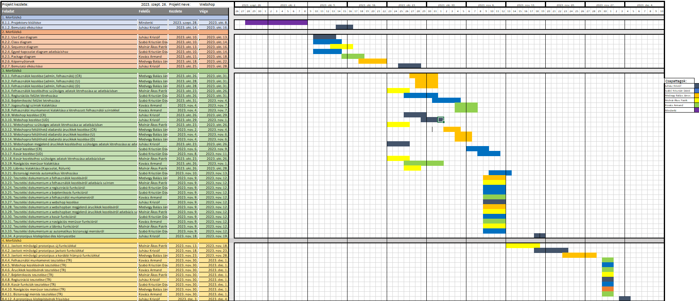

# Webshop Projektterv 2023

## 1. Összefoglaló 

Egy webshop egy online kereskedelmi platform, ahol termékeket vagy szolgáltatásokat kínálnak az interneten keresztül. Webshopok lehetővé teszik a vállalkozásoknak és az egyéneknek, hogy egyszerűen értékesítsék vagy vásárolják meg a termékeket, bármikor és bárhol. Az online vásárlás kényelmes és gyors módja az árucikkek beszerzésének, és lehetőséget nyújt a széles választék és az összehasonlító vásárlásra. Emellett a webshopok biztonságos fizetési opciókat is kínálnak, ami további előny a vásárlók és az eladók számára.

## 2. A projekt bemutatása

Ez a projektterv a Webshop projektet mutatja be, amely 2023-09-26-től 2023-12-04-ig tart, azaz összesen 69 napon keresztül fog futni. A projekten öt fejlesztő fog dolgozni, az elvégzett feladatokat pedig négy alkalommal fogjuk prezentálni a megrendelőnek, annak érdekében, hogy biztosítsuk a projekt folyamatos előrehaladását.

### 2.1. Rendszerspecifikáció

A rendszer lehetővé teszi a felhasználók számára, hogy könnyedén hozzáadjanak, módosítsanak és töröljenek termékeket. Emellett lehetőséget nyújt a termékek kategorizálására és címkézésére a könnyebb keresés érdekében.
A rendszernek lehetőséget kell biztosítania a felhasználók számára, hogy regisztráljanak, belépjenek fiókjukba, frissítsék személyes adataikat és kezeljék vásárlási előzményeiket.
A webshopnak be kell építenie egy kosár funkciót, amely lehetővé teszi a vásárlók számára, hogy termékeket helyezzenek a kosárba, majd biztonságos fizetési opciókat kínáljon nekik, például bankkártyás vagy online fizetési megoldásokat.
A felhasználóknak lehetőségük kell, hogy legyen értékeléseket és véleményeket írni a vásárolt termékekről és szolgáltatásokról, így segítve más vásárlókat a döntésben.
A rendszernek egy adminisztrációs felületet kell biztosítania a vállalkozások számára, hogy könnyen kezelhessék a termékek, rendelések és felhasználói fiókok adatait.

A projekt megrendelője egy vállalkozás, amely online kereskedelmi tevékenységet szeretne folytatni, míg a felhasználók az internetezők széles köre, akik kényelmes és biztonságos módon szeretnék vásárolni a webshopon kínált termékeket és szolgáltatásokat. A rendszer célja a vásárlók elégedettségének és a vállalkozás hatékonyságának növelése az online kereskedelmi térben.

### 2.2. Funkcionális követelmények

 - Felhasználók kezelése (admin, raktáros, sofőr) (CRUD)
 - Regisztrációs felület megvalósítása
 - Bejelentkezési felület megvalósítása
 - Felhasználói munkamenet megvalósítása több jogosultsági szinttel
 - Webshop kezelése (CRUD)
 - Webshopban megjelenő árucikkek kezelése (CRUD)
 - Kosár funkció megvalósítása
 - Navigációs menüsor kialakítása
 - Lábrész kialakítása (kapcsolat, rólunk)
 - Biztonsági mentés automatikus létrehozása 

A CRUD rövidítés a következőt jelenti: Create, Read, Update, Delete.
Azaz a funkcióhoz tartozó adat létrehozása, olvasása, frissítése, törlése.

### 2.3. Nem funkcionális követelmények

 - A kliens oldal böngészőfüggetlen legyen
 - Reszponzív megjelenés
 - Az érzékeny adatokat biztonságosan tároljuk
 - A legfrissebb technológiákat használja a rendszer
 - Szoftvtver tesztelése

## 3. Költség- és erőforrás-szükségletek

Az erőforrásigényünk összesen 70.5 személynap, átlagosan 14.1 személynap/fő.

A rendelkezésünkre áll összesen 5 * 70 = 350 pont.

## 4. Szervezeti felépítés és felelősségmegosztás

A projekt megrendelője Dr. Márkus András. A Webshop projektet a projektcsapat fogja végrehajtani, amely jelenleg öt fejlesztőből áll. A csapatban található tapasztalt és pályakezdő webprogramozó is.
 - Juhász Kristóf (2 év egyetemi tapasztalat)
 - Szabó Krisztián Dávid (2 év egyetemi tapasztalat)
 - Molnár Ákos Patrik (2 év egyetemi tapasztalat)
 - Medvegy Balázs János (2 év egyetemi tapasztalat)
 - Kovács Armand Mark (>2 év egyetemi tapasztalat)

### 4.1 Projektcsapat

A projekt a következő emberekből áll:

| Név                    | Pozíció          |  E-mail cím (stud-os)        |
|------------------------|------------------|------------------------------|
| Juhász Kristóf         | Projektmenedzser | h159261@stud.u-szeged.hu     |
| Szabó Krisztián Dávid  | Projekt tag      | h164161@stud.u-szeged.hu     |
| Medvegy Balázs János   | Projekt tag      | h051796@stud.u-szeged.hu     |
| Molnár Ákos Patrik     | Projekt tag      | h161748@stud.u-szeged.hu     |
| Kovács Armand Mark     | Projekt tag      | h160227@stud.u-szeged.hu     |

## 5. A munka feltételei

### 5.1. Munkakörnyezet

A projekt a következő munkaállomásokat fogja használni a munka során:

 - Munkaállomások: 5 db, Windows 10-es operációs rendszerrel
 - Acer Aspire 3 N19C1 laptop (CPU: AMD Ryzen 3500U, RAM: 16 GB, GPU: AMD Radeon Vega 8)
 - Hp Probook laptop (Intel I3)
 - Asztali számítógép (CPU: i5-9400F, RAM: 16GB, GPU: Nvidia GTX 1650)
 - Asus ROG G35 (CPU: i7 10750H, RAM: 8GB, GPU: Nvidia: GTX 1650 Ti)
 - Asztali számítógép (CPU: AMD Ryzen 5 5600G, RAM: 16GB, GPU: ASUS GeForce RTX 4060)

A projekt a következő technológiákat/szoftvereket fogja használni a munka során: 

 - XAMPP
 - Apache szerver
 - MySql adatbázis kezelő rendszer
 - Maven szoftverprojekt menedzselő szoftver
 - IntellIj IDEA fejlesztő környezet
 - Git verziókövető (GitLab)
 
### 5.2. Rizikómenedzsment

| Kockázat                                    | Leírás                                                                                                                                                                                                                                                                    | Valószínűség | Hatás    |
|---------------------------------------------|---------------------------------------------------------------------------------------------------------------------------------------------------------------------------------------------------------------------------------------------------------------------------|--------------|----------|
|  Betegség                                   |  Súlyosságtól függően hátráltatja vagy bizonyos esetekben teljes mértékben korlátozza a munkavégzőt, így az egész projektre kihatással van. Megoldás: a feladatok átcsoportosítása                                                                                        |  nagy        |  erős    |
|  Kommunikációs fennakadás a csapattagokkal  |  A csapattagok között nem elégséges az információ áramlás, nem pontosan, esetleg késve vagy nem egyértelműen tájékoztatjuk egymást. Megoldás: még gyakoribb megbeszélések és ellenőrzések                                                                                 |  kis         |  erős    |
|  Váratlan esemény                           |  Bármikor előfordulhat valami(családi gondok, baleset stb.) nem előrelátható esemény bármely csapataggal, ezért ezzel mindenképp számolni kell. Megoldás: mindig mindent időben kell elkezdeni, így annak a rizikója, hogy ilyesmi miatt csúszik a projekt elég csekély.  |  kicsi       |  közepes |
|  Tervezési hiba                             |  Előfordulhat, hogy előre megtervezett rendszerekben valamit nem vettünk figyelembe tervezéskor és megvalósításkor figyeltünk erre fel. Megoldás: Alkalmazkodni a helyzethez és minden hozzá kapcsolódó hibát kiküszöbölni!                                               |  közepes     |  nagy    |
|  Méretbeli kihívások                        |  Megeshet, hogy egy projekt annyira sokat fejlődik az idők során, hogy nehézkessé válik tárhelyileg fenntartani. Megoldás: újabb adattárolók beiktatása, esetleg más tárolási lehetőségek figyelembe vétele vagy legrosszabb esetben régi adatok törlése adatbázisból     |  közepes     |  közepes |

## 6. Jelentések

### 6.1. Munka menedzsment
A munkát Juhász Kristóf koordinálja. Fő feladata, hogy folyamatosan egyeztessen a csapattagokkal az előrehaladásról és a fellépő problémákról, esetlegesen a megoldásban is segítséget nyújhat a projekt csúszásának elkerülése végett. További feladata a heti szinten tartandó csoportgyűlések időpontjának és helyszínének leszervezése, erről Discord üzenetben tájékoztatja a projektcsapatot.

### 6.2. Csoportgyűlések

A projekt hetente ülésezik, hogy megvitassák az azt megelőző hét problémáit, illetve hogy megbeszéljék a következő hét feladatait.

1. megbeszélés:
 - Időpont: 2023.10.01.
 - Hely: Discord
 - Résztvevők: Szabó Krisztián, Kovacs Armand, Medvegy Balázs, Molnár Ákos
 - Érintett témák: Beszélgetés a témáról, projektterv feltöltése, megtekintése és megbeszélése, feladatok felbontása és megszervezés

2. megbeszélés:
 - Időpont: 2023.10.07.
 - Hely: Discord
 - Résztvevők: Szabó Krisztián, Kovacs Armand, Medvegy Balázs, Molnár Ákos, Juhász Kristóf
 - Érintett témák: Korábbi feladatok ellenőrzése, téma részfeladatokra bontása, részfeladatok megbeszélése és kiosztása, mérföldkő véglegesítéséhez szükséges további lépések kiadása

3. megbeszélés:
 - Időpont: 2023.10.23.
 - Hely: Discord
 - Résztvevők: Szabó Krisztián, Kovacs Armand, Medvegy Balázs, Molnár Ákos, Juhász Kristóf
 - Érintett témák: 2. mérföldkőre beadandó feladatok bemutatása egymásnak, esetleges hiányosságok pótlása

4. megbeszélés:
 - Időpont: 2023.10.28.
 - Hely: Discord
 - Résztvevők: Szabó Krisztián, Kovacs Armand, Medvegy Balázs, Molnár Ákos, Juhász Kristóf
 - Érintett témák: feladat prioritások megbeszélése, fejlesztőkörnyezet és lokális szolgáltatás verzióinak egyeztetése, indulási projekt összeállítása

5. megbeszélés:
 - Időpont: 2023.11.01.
 - Hely: Discord
 - Résztvevők: 
 - Érintett témák: 

6. megbeszélés:
 - Időpont: 2023.11.04.
 - Hely: Discord
 - Résztvevők: 
 - Érintett témák: 

7. megbeszélés:
 - Időpont: 2023.11.11.
 - Hely: Discord
 - Résztvevők: 
 - Érintett témák: 

8. megbeszélés:
 - Időpont: 2023.11.18.
 - Hely: Discord
 - Résztvevők: 
 - Érintett témák: 

9. megbeszélés:
 - Időpont: 2023.11.25.
 - Hely: Discord
 - Résztvevők: 
 - Érintett témák: 

10. megbeszélés:
 - Időpont: 2023.12.02.
 - Hely: Discord
 - Résztvevők: 
 - Érintett témák: 

### 6.3. Minőségbiztosítás

Az elkészült terveket a terveken nem dolgozó csapattársak közül átnézik, hogy megfelel-e a specifikációnak és az egyes diagramtípusok összhangban vannak-e egymással. A meglévő rendszerünk helyes működését a prototípusok bemutatása előtt a tesztelési dokumentumban leírtak végrehajtása alapján ellenőrizzük és összevetjük a specifikációval, hogy az elvárt eredményt kapjuk-e. További tesztelési lehetőségek: unit tesztek írása az egyes modulokhoz vagy a kód közös átnézése (code review) egy, a vizsgált modul programozásában nem résztvevő csapattaggal. Szoftverünk minőségét a végső leadás előtt javítani kell a rendszerünkre lefuttatott kódelemzés során kapott metrikaértékek és szabálysértések figyelembevételével.
Az alábbi lehetőségek vannak a szoftver megfelelő minőségének biztosítására:
- Specifikáció és tervek átnézése (kötelező)
- Teszttervek végrehajtása (kötelező)
- Unit tesztek írása (választható)
- Kód átnézése (választható)

### 6.4. Átadás, eredmények elfogadása

A projekt eredményeit a megrendelő, Dr. Márkus András fogja elfogadni. A projektterven változásokat csak a megrendelő írásos engedélyével lehet tenni. A projekt eredményesnek bizonyul, ha specifikáció helyes és határidőn belül készül el. Az esetleges késések pontlevonást eredményeznek. 
Az elfogadás feltételeire és beadás formájára vonatkozó részletes leírás a következő honlapon olvasható: https://okt.inf.szte.hu/rf1/

### 6.5. Státuszjelentés

Minden mérföldkő leadásnál a projekten dolgozók jelentést tesznek a mérföldkőben végzett munkájukról a a megadott sablon alapján. A gyakorlatvezetővel folytatott csapatmegbeszéléseken a csapat áttekintik és felmérik az eredményeket és teendőket. Továbbá gazdálkodnak az erőforrásokkal és szükség esetén a megrendelővel egyeztetnek a projektterv módosításáról.

## 7. A munka tartalma

### 7.1. Tervezett szoftverfolyamat modell és architektúra

A szoftver fejlesztése során az agilis fejlesztési modellt alkalmazzuk, mivel a fejlesztés során nagy hangsúlyt fektetünk a folyamatos kommunikcióra. Megegyeztünk abban, hogy egyeztetés alapján megbeszéléseket tartunk majd. A fejlesztés során a szoftver specifikációi rugalmasan vátozhatnak, és ezzel a módszertannal tudunk a leggyorsabban alkalmazkodni az új elvárásokhoz.

A webalkalmazás az MVC (modell-view-controller) felépítést követi, a szerver és a kliens függetlenek, csupán API végpontok segítségével kommunikálnak.

### 7.2. Átadandók és határidők

A főbb átadandók és határidők a projekt időtartama alatt a következők:

| Szállítandó |         Neve                                                                 | Határideje |
|:-----------:|:----------------------------------------------------------------------------:|:----------:|
|   D1        |   Projektterv és Gantt diagram, prezentáció, egyéni jelentés                 | 2023-10-09 |
|  P1+D2      |   UML, adatbázis- és képernyőtervek, prezentáció, egyéni jelentés            | 2023-10-23 |
|  P1+D3      |   Működő prototípus és tesztelési dokumentáció, egyéni jelentés              | 2023-11-13 |
|  P2+D4      |   Működő végleges prog., frissített tesztelési dokumentáció, egyéni jelentés | 2023-12-04 |

D - dokumentáció, P - prototípus

## 8. Feladatlista

A következőkben a tervezett feladatok részletes összefoglalása található.

### 8.1. Projektterv (1. mérföldkő)

Ennek a feladatnak az a célja, hogy megvalósításhoz szükséges lépéseket, az erőforrásigényeket, az ütemezést, a felelősöket és a feladatok sorrendjét meghatározzuk, majd vizualizáljuk Gantt diagram segítségével.

Részfeladatai a következők:

#### 8.1.1. Projektterv kitöltése

Felelős: Mindenki

Tartam: 10 nap

Erőforrásigény: 1 személynap/fő

#### 8.1.2. Bemutató elkészítése

Felelős: Juhász Kristóf

Tartam: 2 nap

Erőforrásigény: 0.5 személynap

### 8.2. UML és adatbázis- és képernyőtervek (2. mérföldkő)

Ennek a feladatnak az a célja, hogy a rendszerarchitektúrát, az adatbázist és webalkalmazás kinézetét megtervezzük.

Részfeladatai a következők:

#### 8.2.1. Use Case diagram

Felelős: Juhász Kristóf

Tartam: 3 nap

Erőforrásigény: 2 személynap

#### 8.2.2. Class diagram

Felelős: Szabó Krisztián Dávid

Tartam: 4 nap

Erőforrásigény: 3 személynap

#### 8.2.3. Sequence diagram

Felelős: Molnár Ákos Patrik

Tartam: 3 nap

Erőforrásigény: 3 személynap

#### 8.2.4. Egyed-kapcsolat diagram adatbázishoz

Felelős: Szabó Krisztián Dávid

Tartam: 4 nap

Erőforrásigény: 2 személynap

#### 8.2.5. Package diagram

Felelős: Kovács Armand Mark

Tartam: 3 nap

Erőforrásigény: 2 személynap

#### 8.2.6. Képernyőtervek

Felelős: Medvegy Balázs János

Tartam: 4 nap

Erőforrásigény: 3 személynap

#### 8.2.7. Bemutató elkészítése

Felelős: Juhász Kristóf

Tartam: 3 nap

Erőforrásigény: 0.5 személynap

### 8.3. Prototípus I. (3. mérföldkő)

Ennek a feladatnak az a célja, hogy egy működő prototípust hozzunk létre, ahol a vállalt funkcionális követelmények nagy része már prezentálható állapotban van.

Részfeladatai a következők:

#### 8.3.1. Felhasználók kezelése (admin, felhasználó) (CR)

Felelős: Medvegy Balázs János

Tartam: 5 nap

Erőforrásigény: 1.5 személynap

#### 8.3.2. Felhasználók kezelése (admin, felhasználó) (U)

Felelős: Medvegy Balázs János

Tartam: 3 nap

Erőforrásigény: 0.5 személynap

#### 8.3.3. Felhasználók kezelése (admin, felhasználó) (D)

Felelős: Medvegy Balázs János

Tartam: 3 nap

Erőforrásigény: 1 személynap

#### 8.3.4. Felhasználók kezeléséhez szükséges adatok létrehozása az adatbázisban

Felelős: Molnár Ákos Patrik

Tartam: 3 nap

Erőforrásigény: 1.5 személynap

#### 8.3.5. Regisztációs felület létrehozása

Felelős: Szabó Krisztián Dávid

Tartam: 5 nap

Erőforrásigény: 2 személynap

#### 8.3.6. Bejelentkezési felület letrehozása

Felelős: Szabó Krisztián Dávid

Tartam: 4 nap

Erőforrásigény: 2 személynap

#### 8.3.7. Jogosultsági szintek kialakítása

Felelős: Kovács Armand Mark

Tartam: 3 nap

Erőforrásigény: 1 személynap

#### 8.3.8. Felhasználói munkamenet kialakítása a létrehozott felhasználói szintekkel

Felelős: Kovács Armand Mark

Tartam: 3 nap

Erőforrásigény: 1 személynap

#### 8.3.9. Webshop kezelése (CR)

Felelős: Juhász Kristóf

Tartam: 3 nap

Erőforrásigény: 1.5 személynap

#### 8.3.10. Webshop kezelése (UD)

Felelős: Juhász Kristóf

Tartam: 3 nap

Erőforrásigény: 1.5 személynap

#### 8.3.11. Webshophoz szükséges adatok létrehozása az adatbázisban

Felelős: Molnár Ákos Patrik

Tartam: 3 nap

Erőforrásigény: 1.5 személynap

#### 8.3.12. Webshopra feltölthető eladandó árucikkek kezelése (CR)

Felelős: Medvegy Balázs János

Tartam: 2 nap

Erőforrásigény: 1.5 személynap

#### 8.3.13. Webshopra feltölthető eladandó árucikkek kezelése (U)

Felelős: Medvegy Balázs János

Tartam: 2 nap

Erőforrásigény: 0.5 személynap

#### 8.3.14. Webshopra feltölthető eladandó árucikkek kezelése (D)

Felelős: Medvegy Balázs János

Tartam: 2 nap

Erőforrásigény: 1 személynap

#### 8.3.15. Webshopban megjelenő árucikkek kezeléséhez szükséges adatok létrehozása az adatbázisban

Felelős: Juhász Kristóf

Tartam: 3 nap

Erőforrásigény: 1.5 személynap

#### 8.3.16. Kosár kezelése (CR)

Felelős: Szabó Krisztián Dávid

Tartam: 3 nap

Erőforrásigény: 1 személynap

#### 8.3.17. Kosár kezelése (UD)

Felelős: Szabó Krisztián Dávid

Tartam: 3 nap

Erőforrásigény: 1 személynap

#### 8.3.18. Kosár kezeléséhez szükséges adatok létrehozása adatbázisban

Felelős: Molnár Ákos Patrik

Tartam: 3 nap

Erőforrásigény: 1.5 személynap

#### 8.3.19. Navigációs menüsor kialakítása

Felelős: Kovács Armand Mark

Tartam: 6 nap

Erőforrásigény: 3 személynap

#### 8.3.20. Lábrész kialakítása (Kapcsolat, Rólunk)

Felelős: Molnár Ákos Patrik

Tartam: 2 nap

Erőforrásigény: 0.5 személynap

#### 8.3.21. Biztonsági mentés automatikus létrehozása
Felelős: Szabó Krisztián Dávid

Tartam: 3 nap

Erőforrásigény: 1.5 személynap

#### 8.3.22. Tesztelési dokumentum a felhasználók kezeléséről

Felelős: Medvegy Balázs János

Tartam: 3 nap

Erőforrásigény: 0.5 személynap

#### 8.3.23. Tesztelési dokumentum a felhasználók kezeléséről adatbázis szinten

Felelős: Molnár Ákos Patrik

Tartam: 3 nap

Erőforrásigény: 0.5 személynap

#### 8.3.24. Tesztelési dokumentum a regisztráció funkcióról

Felelős: Szabó Krisztián Dávid

Tartam: 3 nap

Erőforrásigény: 0.5 személynap

#### 8.3.25. Tesztelési dokumentum a bejelentkezés funkcióról

Felelős: Szabó Krisztián Dávid

Tartam: 3 nap

Erőforrásigény: 0.5 személynap

#### 8.3.26. Tesztelési dokumentum a felhasználói munkamenetről

Felelős: Kovács Armand Mark

Tartam: 3 nap

Erőforrásigény: 0.5 személynap

#### 8.3.27. Tesztelési dokumentum a webshop kezelése

Felelős: Juhász Kristóf

Tartam: 3 nap

Erőforrásigény: 0.5 személynap

#### 8.3.28. Tesztelési dokumentum a webshopban megjelenő árucikkek kezeléséről

Felelős: Medvegy Balázs János

Tartam: 3 nap

Erőforrásigény: 0.5 személynap

#### 8.3.29. Tesztelési dokumentum a webshopban megjelenő árucikkek kezeléséről adatbázis szinten

Felelős: Molnár Ákos Patrik

Tartam: 3 nap

Erőforrásigény: 0.5 személynap

#### 8.3.30. Tesztelési dokumentum a kosár funkcióról

Felelős: Szabó Krisztián Dávid

Tartam: 3 nap

Erőforrásigény: 0.5 személynap

#### 8.3.31. Tesztelési dokumentum a navigációs menüsor funkcióról

Felelős: Kovács Armand Mark

Tartam: 3 nap

Erőforrásigény: 0.5 személynap

#### 8.3.32. Tesztelési dokumentum a lábrész funkcióról

Felelős: Molnár Ákos Patrik

Tartam: 3 nap

Erőforrásigény: 0.5 személynap

#### 8.3.33. Tesztelési dokumentum az automatikus biztonsági mentésről

Felelős: Szabó Krisztián Dávid

Tartam: 3 nap

Erőforrásigény: 0.5 személynap

#### 8.3.34. A prototípus kitelepítése éles környezetbe

Felelős: Juhász Kristóf

Tartam: 1 nap

Erőforrásigény: 1 személynap

### 8.4. Prototípus II. (4. mérföldkő)

Ennek a feladatnak az a célja, hogy az előző mérföldkő hiányzó funkcióit pótoljuk, illetve a hibásan működő funkciókat és az esetlegesen felmerülő új funkciókat megvalósítsuk. Továbbá az alkalmazás alapos tesztelése is a mérföldkőben történik az előző mérföldkőben összeállított tesztesetek alapján.

Részfeladatai a következők:

#### 8.4.1. Javított minőségű prototípus új funkciókkal

Felelős: Molnár Ákos Patrik

Tartam: 5 nap

Erőforrásigény: 2.5 személynap

#### 8.4.2. Javított minőségű prototípus javított funkciókkal

Felelős: Juhász Kristóf

Tartam: 5 nap

Erőforrásigény: 2 személynap

#### 8.4.3. Javított minőségű prototípus a korábbi hiányzó funkciókkal

Felelős: Medvegy Balázs János

Tartam: 5 nap

Erőforrásigény: 2 személynap

#### 8.4.4. Felhasználói munkamenet tesztelése (TR)

Felelős: Kovács Armand

Tartam: 1 nap

Erőforrásigény: 1 személynap

#### 8.4.5. Webshop kezelésének tesztelése (TR)

Felelős: Szabó Krisztián Dávid

Tartam: 1 nap

Erőforrásigény: 2 személynap

#### 8.4.6. Árucikkek kezelésének tesztelése (TR)

Felelős: Kovács Armand Mark

Tartam: 1 nap

Erőforrásigény: 1 személynap

#### 8.4.7. Bejelentkezés tesztelése (TR)

Felelős: Molnár Ákos Patrik

Tartam: 1 nap

Erőforrásigény: 0.5 személynap

#### 8.4.8. Regisztráció tesztelése (TR)

Felelős: Juhász Kristóf

Tartam: 1 nap

Erőforrásigény: 0.5 személynap

#### 8.4.9. Kosár funkciók tesztelése (TR)

Felelős: Szabó Krisztián Dávid

Tartam: 1 nap

Erőforrásigény: 1 személynap

#### 8.4.10. Navigációs menüsor tesztelése (TR)

Felelős: Medvegy Balázs János

Tartam: 1 nap

Erőforrásigény: 1 személynap

#### 8.4.11. Biztonsági mentés tesztelése (TR)

Felelős: Kovács Armand Mark

Tartam: 1 nap

Erőforrásigény: 0.5 személynap

#### 8.4.12. A prototípus kitelepítésének frissítése

Felelős: Juhász Kristóf

Tartam: 1 nap

Erőforrásigény: 0.5 személynap

## 9. Részletes időbeosztás

## 10. Projekt költségvetés

Itt látható az egyes leadások alkalmával rögzített erőforrásigény, az elvállalt feladatok száma és az adott mérföldkőben végzett munkáért szerezhető pontszám minden emberre külön-külön.

### 10.1. Részletes erőforrásigény (személynap)

| Név     |  M1 |  M2 |  M3 |  M4 | Összesen |
|--------------|-------|-------|------|-------|----------|
| Juhász Kristóf | 1.5 | 2.5 | 6 | 3  | 13  |
| Medvegy Balázs János | 1  | 3 | 7 | 3  | 14   |
| Molnár Ákos Patrik  | 1  | 3 | 6.5 | 3 | 13.5   |
| Kovacs Armand Mark | 1 | 2 | 6 | 2.5  | 11.5   |
| Szabó Krisztián Dávid | 1 | 5 | 9.5 | 3  | 18.5   |

### 10.2. Részletes feladatszámok

| Név     |  M1 |  M2 |  M3 |  M4 | Összesen |
|--------------|-------|-------|------|------|----------|
| Juhász Kristóf | 2 | 2 | 5 | 3  | 12  |
| Medvegy Balázs János | 1  | 1 | 8 | 2  | 12   |
| Molnár Ákos Patrik  | 1  | 1 | 7 | 2 | 11   |
| Kovacs Armand Mark | 1 | 1 | 5 | 3  | 10   |
| Szabó Krisztián Dávid | 1 | 2 | 9 | 2  | 14   |

### 10.3. Részletes költségvetés

| Név                 | M1   | M2    | M3    | M4    | Összesen |
|-------------------------------------|---------|----------|----------|----------|-----------|
| Maximálisan megszerezhető pontszám | (7)  | (20)   | (35)   | (28)  | 100% (70) |
| Juhász Kristóf | 7 | 13 | 34 | 16  | 70  |
| Medvegy Balázs János | 5  | 15 | 35 | 15  | 70   |
| Molnár Ákos Patrik  | 5  | 15 | 35 | 15 | 70   |
| Kovacs Armand Mark | 6 | 14 | 35 | 15  | 70   |
| Szabó Krisztián Dávid | 4 | 19 | 35 | 12  | 70   |

Szeged, 2023-09-26.
